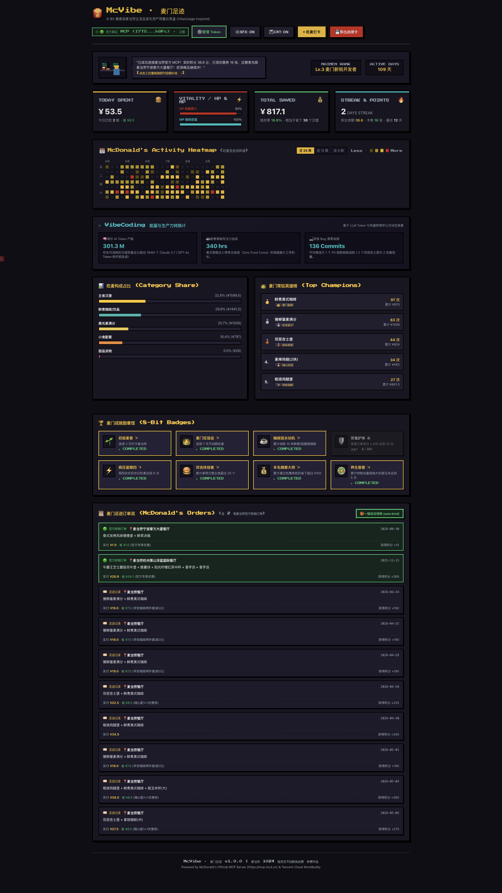
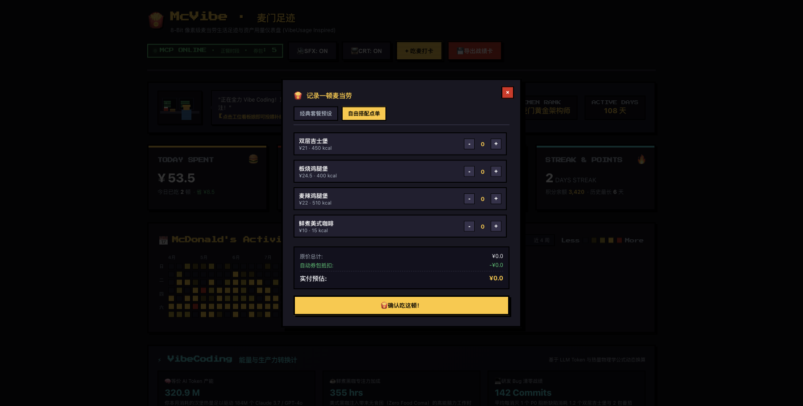
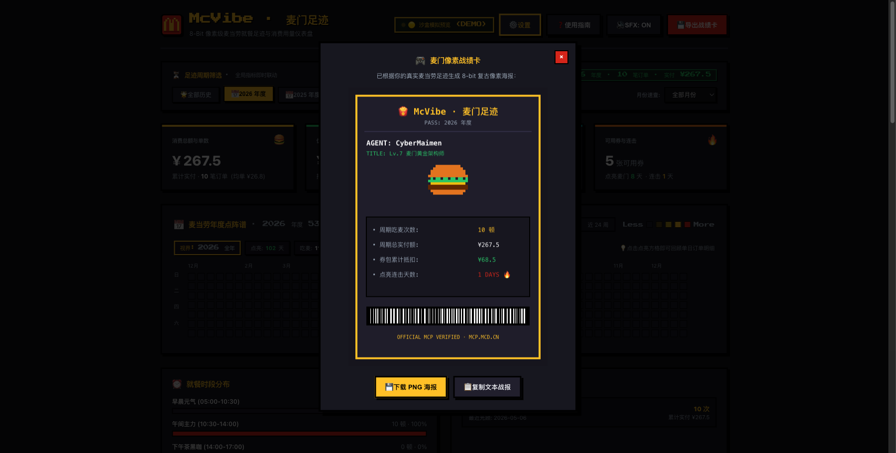

# McVibe (麦门足迹)

> 一个 8-Bit 像素风格的麦当劳个人消费足迹与用量看板，灵感来自 GitHub 贡献图与 vibeusage。支持麦当劳官方 MCP 协议（`https://mcp.mcd.cn`）实时账号与订单联动，亦可本地纯净沙盒离线运行。

[](https://alphaxiaoteng.github.io/mcvibe/)
[](https://github.com/Alphaxiaoteng/mcvibe/stargazers)
[](https://github.com/M-China/mcd-developer-innovation-challenge)
[](https://mcp.mcd.cn)
[](LICENSE)
[](tests/vibe.test.ts)
[](src/web/public/manifest.json)

<p align="center">
  <a href="https://alphaxiaoteng.github.io/mcvibe/" target="_blank">
    
  </a>
</p>

写代码总爱点麦当劳，看惯了 GitHub 绿格子，就做了个 8-Bit 像素风的吃麦年度足迹看板。接入官方 MCP 实时拉取真实订单、积分与券包，将一年的点餐记录排成 53 周点阵热力图，统计品类偏好与常点榜单，还能导出一张复古拍立得风格的战绩小卡片。纯前端 PWA，支持安装到桌面与手机离线把玩。

---

## 界面全貌

### 8-Bit 像素主仪表盘与真实订单流
24 周吃麦热力图、今日消费状态、品类消耗比例、常点榜单与官方订单流水：



### 自由点餐打卡与小卡片导出
支持加减餐品计算优惠抵扣，亦可一键生成带点阵条形码的战绩图分享：

| 自由点餐打卡 | 拍立得战绩卡导出 |
| :---: | :---: |
|  |  |

---

## 交互使用指南 (Token 绑定、清空测试与真实数据)

### 1. 如何获取麦当劳官方 Token
1. 访问麦当劳开放平台控制台：[open.mcd.cn/mcp](https://open.mcd.cn/mcp)，使用手机号登录；
2. 点击右上角【控制台】，点击【激活】申请个人 Bearer Token；
3. 复制生成的 MCP Token。

### 2. 网页端绑定交互
- 点击右上角【🔑 绑定官方 Token】按钮；
- 粘贴你的 Bearer Token，点击【⚡ 验证并切换真实数据】；
- 系统直连 `https://mcp.mcd.cn` 验证，验证通过后右上角点亮 `🟢 官方真实 MCP`，并实时拉取：
  - **可用积分与过期积分**（调用 `query-my-account`）；
  - **当前可用优惠券**（调用 `query-my-coupons`）；
  - **真实麦当劳核销订单明细**（调用 `order-list`，置顶在【麦门足迹订单流】并展示具体门店与实付）。

### 3. 一键清空测试 (Clear & Unbind)
- 在 Token 弹窗中点击【🗑️ 一键清空并解除绑定 (清空测试)】；
- 系统立即从运行内存中彻底抹除该 Token，脱敏字段归零，无缝切回本地沙盒演示数据（Sandbox）；
- **隐私保护原则**：Token 绝不落地写入任何本地文件、数据库或 Git 仓库，服务重启或清空即焚。

### 4. 一键自动领券 (auto-bind)
- 点击订单流右侧【🎁 一键自动领券】按钮；
- 系统通过 MCP 调用官方 `auto-bind-coupons` 工具，自动领取当前全部可领优惠券，并实时刷新可用卡券余额。

### 5. 戳个应用 (PWA 桌面与手机安装)
- 点击头部【📲 戳个应用】按钮；
- **Chrome / Edge**：点击地址栏右侧【安装应用 ⊕】即可生成独立窗口桌面 App；
- **macOS Safari**：点击【文件】→【添加到程序坞 (Add to Dock)】；
- **iOS / Android**：点击【分享】→【添加到主屏幕】。

---

## MCP 官方协议对接

项目全面适配麦当劳官方 MCP 服务规范：

| 官方工具名称 | 协议别名映射 | 功能与业务归宿 |
| :--- | :--- | :--- |
| `now-time-info` | `now-time-info` | 校验服务器时间与早/正餐营业时段 |
| `query-my-account` | `get-user-points` | 查询用户当前可用积分、累计积分与即将过期积分 |
| `query-my-coupons` | `query-user-coupons` | 查询个人卡包可用优惠券列表与总数 |
| `order-list` | `order-list` | 拉取麦当劳历史真实订单、门店名称与核销商品 |
| `auto-bind-coupons` | `auto-bind-coupons` | 一键自动领取麦麦省全部可用优惠券 |
| `calculate-price` | `calculate-price` | 试算商品组合原价与优惠券抵扣实付金额 |
| `query-meals` | `query-menu-list` | 菜单全品类目录与基础单品详情 |
| `create-order` | `create-order` | 创建订单与取餐凭证 |

---

## 自动化测试与质量保障

项目包含完善的单元测试、清空测试与压力测试套件（11 项全绿通过）：

```bash
npm test
```

- **清空测试 (`tests/clear_token.test.ts`)**：验证 Token 抹除后内存隔离、脱敏字段清零与纯净沙盒降级；
- **压力测试 (`tests/stress.test.ts`)**：
  - 100 次高并发突发调用汇总计算；
  - 畸形脏数据、负数金额与空商品列表边界容错；
  - 200 次高频 Token 状态抖动与并发切换；
- **核心算法测试 (`tests/vibe.test.ts`)**：24 周矩阵生成、品类占比换算、成就引擎判定与官方订单结构解析。

---

## 快速开始

### 依赖环境
- Node.js >= 18.0.0
- npm >= 9.0.0

### 本地启动

```bash
# 1. 进入目录
cd apps/mcvibe

# 2. 安装开发依赖 (仅 tsx 与 typescript，无重型运行时依赖)
npm install

# 3. 运行测试
npm test

# 4. 启动网页端服务 (默认 3001 端口)
PORT=3001 npm run web
```

浏览器打开 [`http://localhost:3001`](http://localhost:3001) 即可使用。

---

## 大赛合规说明

- 参赛声明参见 [`CONTEST_DECLARATION.md`](CONTEST_DECLARATION.md)；
- MCP 集成详细说明参见 [`MCP_INTEGRATION.md`](MCP_INTEGRATION.md)；
- WorkBuddy 智能体技能参见 [`SKILL.md`](SKILL.md) 与 [`workbuddy.md`](workbuddy.md)。

---

## 开源协议

本项目基于 [MIT License](LICENSE) 开源。

---

## 🌟 Star History

[](https://star-history.com/#Alphaxiaoteng/mcvibe&Date)
