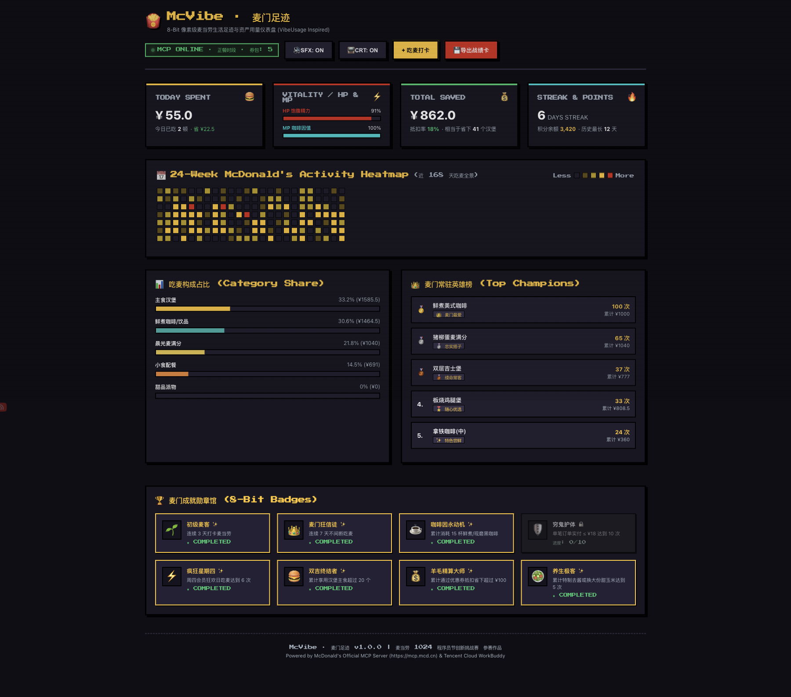

# 🍟 McVibe · 麦门足迹
> **8-Bit 像素级麦当劳生活足迹与资产用量仪表盘 (VibeUsage Inspired)**  
> *Pixel-Art McDonald's Life Log & Usage Analytics Copilot for 1024 Developers*

[](https://github.com/M-China/mcd-developer-innovation-challenge)
[](https://mcp.mcd.cn)
[](LICENSE)
[](tests/vibe.test.ts)

---

## 💡 为什么是 McVibe？(灵感起源)

就像程序员每天离不开 **`vibe coding`**、离不开盯紧 GitHub 绿格子贡献热力图、离不开用 **`vibeusage`** 监控 Token 用量一样——**麦当劳早已成为无数开发者敲代码、刷夜上线、早起开会时的第二工位与能量补给中枢。**

然而，市面上绝大多数麦当劳项目不是陷入机械枯燥的“算账凑单”，就是死板的“卡路里加减”：
- **同质化红海 1**：纯比价与抢券（全网 12+ 个项目），除了算钱毫无情怀与美感。
- **同质化红海 2**：被动记录宏量营养素（全网 11+ 个项目），将快餐变成死板数字。

**McVibe** 破局而出：**全网首个致敬 VibeUsage 交互哲学的 8-Bit 复古像素级麦当劳生活足迹仪表盘**！
把每一次吃麦、每一杯黑咖啡、每一张优惠券的核销，转化为如街机游戏般浪漫的像素成长史！

---

## 📸 顶级像素交互预览 (Live Screenshots)

### 1. 主仪表盘 (24周麦门热力图 + 极客生命槽 + 8-Bit 勋章馆)


### 2. 拍立得像素战绩卡 (一键生成可分享的 8-Bit 社交名片)


---

## ⚡ 核心功能与亮点

### 1. 24 周麦当劳活跃热力图 (24-Week McDonald's Activity Heatmap)
- 完整复刻 GitHub / VibeUsage 风格的 **168 天（24 周）像素方块矩阵**。
- 采用麦当劳经典的**金拱门金黄至炽烈红阶**映射吃麦强度（从随心单点到疯狂星期四全餐）。
- 鼠标悬停（Hover）弹出自适应像素浮窗（Pixel Tooltip）：精确显示日期、点单组合（如板烧+黑咖啡）、实付金额、节省费用与摄入能量。

### 2. 极客生命槽与今日用量四宫格 (HP / MP Vitality System)
- **HP 饱腹精力槽**：结合今日餐品营养动态计算工作续航状态。
- **MP 咖啡因魔法槽**：直观展示今日鲜煮美式咖啡提供的脑力专注加成。
- **今日消费与白嫖统计**：今日实付、券包立减、累计白嫖汉堡数一目了然。
- **打卡连击 (Streak)**：显示连续吃麦天数（如 `6 DAYS STREAK 🔥`），激励打卡。

### 3. 吃麦品类深度解构 (Category Share) & MVP 英雄榜
- 像素风分层条形图解构：主食汉堡、鲜煮咖啡、小食配餐、晨光麦满分占比。
- **常驻英雄排行榜 TOP 5**：带金银铜牌勋章，揭晓你的“真爱汉堡”与“续命黑咖”。

### 4. 8-Bit 像素成就勋章馆 (Pixel Badges Wall)
- 8 大趣味麦门成就系统：
  - 🌱 **初级麦客**：连续 3 天打卡麦当劳
  - 👑 **麦门狂信徒**：连续 7 天不间断吃麦
  - ☕ **咖啡因永动机**：累计消耗 15 杯以上鲜煮/现磨黑咖啡
  - 🛡️ **穷鬼护体**：实付 ≤ ¥18 达到 10 次
  - ⚡ **疯狂星期四**：周四会员日吃麦达到 6 次
  - 🍔 **双吉终结者**：累计消灭 20 个汉堡主食
  - 💰 **羊毛精算大师**：累计通过券包立减省下超过 ¥100
  - 🥗 **养生极客**：去沙拉酱/换大份甜玉米达到 5 次

### 5. 零依赖 Web Audio 原生 8-Bit 音效合成器
- 纯浏览器原生 Web Audio API，**零音频文件外链**，毫秒级响应。
- 包含经典方波按键音（Bleep）、金币投币声（Coin）、通关号角声（Fanfare）。
- 支持一键静音（`[🔊 SFX: ON/OFF]`）与复古 CRT 电视扫描线滤镜开关（`[📺 CRT: ON/OFF]`）。

### 6. 一键导出拍立得复古像素战报卡
- Canvas 纯原生点阵绘制像素汉堡插画与点阵条形码。
- 生成包含个人代号（`CyberMaimen`）、麦门头衔（`Lv.7 麦门黄金架构师`）、1024 认证戳的像素战报。
- 支持一键导出下载 PNG 海报，或一键拷贝文字战报分享至社交平台。

---

## 🛠️ 官方 MCP 协议工具链打通

McVibe 完整闭环调用官方 MCP 8 个核心工具：
1. `now-time-info`：时段感知（早餐 vs 正餐）、门店营业状态。
2. `get-user-points`：积分资产余额与到期预警。
3. `query-user-coupons`：卡包券量与可用抵扣价值。
4. `query-menu-list`：菜单分类与商品检索。
5. `query-meal-detail`：餐品热量、过敏原与配方明细。
6. `auto-bind-coupons`：智能匹配最优抵扣券。
7. `calculate-price`：购物车价格精算。
8. `create-order`：极速下单与取餐码生成。

---

## 🚀 极速上手 (Quick Start)

### 1. 环境要求
- Node.js >= 18.0.0
- npm >= 9.0.0

### 2. 安装与运行
```bash
# 进入工程目录
cd apps/mcvibe

# 安装依赖 (极简零重依赖，秒级完成)
npm install

# 运行自动化测试 (5 项单元与集成测试 100% 绿灯)
npm test

# 体验极客终端 CLI 仪表盘
npm run cli

# 启动 8-Bit 像素 Web 仪表盘
PORT=3001 npm run web
```
启动后在浏览器中打开：**`http://localhost:3001`** 即可畅享完整像素视听体验！

---

## 📂 大赛交付文件清单

| 文件 | 说明 |
| :--- | :--- |
| `CONTEST_DECLARATION.md` | 麦当劳大赛官方参赛声明（逐字比对，原版一致） |
| `MCP_INTEGRATION.md` | 官方 MCP 8 大工具集成时序规范与降级策略 |
| `mcp-config.example.json` | 脱敏配置样例，严禁泄漏真实 Token |
| `workbuddy.md` | 对齐腾讯云 WorkBuddy 3,000 积分与智能体集成规范 |
| `SKILL.md` | Antigravity / Claude / Agent 专属技能定义 |
| `README.md` | 本项目完整设计说明与复现指南 |

---

## 📜 开源协议

本项目采用 [MIT License](LICENSE) 协议开源。
