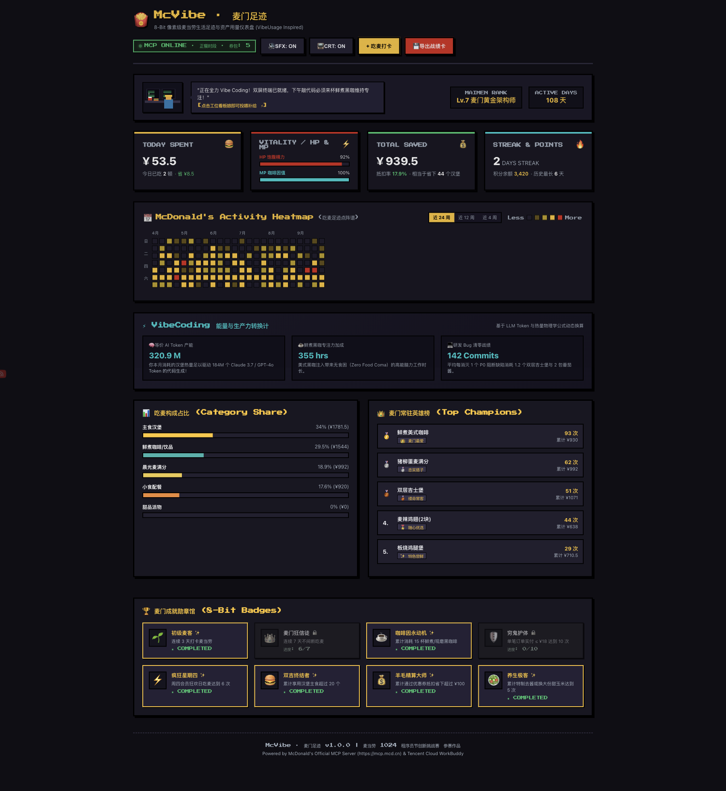

# McVibe (麦门足迹)

> 一个像素风格的麦当劳个人消费足迹与用量看板，灵感来自 GitHub 贡献图与 vibeusage。

[](https://github.com/M-China/mcd-developer-innovation-challenge)
[](https://mcp.mcd.cn)
[](LICENSE)
[](tests/vibe.test.ts)

平时写代码总爱点麦当劳。看习惯了终端里的 Token 消耗和 GitHub 绿格子，就顺手写了这个小工具，把个人吃麦历史、常点单品、优惠券使用和积分变化做成了一个复古像素风的用量看板。

---

## 界面预览

### 主仪表盘
24 周吃麦热力图、今日消费状态条、品类消耗比例与常点榜单：



### 自由点餐与优惠试算
支持选择常见套餐或自己选品加减，实时展示优惠券抵扣与实付金额：


### 像素小卡片导出
一键生成带点阵条形码的战绩图，支持下载 PNG 或复制文字：


---

## 主要功能

- **24 周吃麦热力图**：168 天的方格矩阵，颜色深浅表示当天花费与餐品丰盛度，鼠标悬停展示具体吃了什么，点击可查看当日明细。支持按近 4 周、12 周、24 周切换视图。
- **今日状态面板**：显示当天花费、已省金额、积分余额，以及饱腹状态（HP）和咖啡因指数（MP）。
- **品类比例与常点排行**：统计汉堡、咖啡、小食、早餐的消费分布，排出一份属于你自己的常点 Top 5（比如双吉、鲜煮美式等）。
- **打卡与试算**：除了预设的 1+1 穷鬼套餐、减脂去酱套餐外，支持自由勾选加减餐品，自动匹配可用券并计算实付。
- **工位小动效与音效**：顶部有个敲代码的像素小人，带 8-bit 原生音效（可静音）和 CRT 扫描线开关。
- **战报导出**：基于 Canvas 渲染的复古小票卡片，方便保存与分享。

---

## MCP 协议对接

项目对接了麦当劳官方 MCP 服务（`https://mcp.mcd.cn`），包含 8 个工具调用：

| 工具名称 | 用途 |
| :--- | :--- |
| `now-time-info` | 获取当前营业状态与时段（早餐 / 正餐） |
| `get-user-points` | 查询当前可用积分与到期情况 |
| `query-user-coupons` | 获取卡包内优惠券列表与门槛 |
| `query-menu-list` | 菜单分类与单品基础数据 |
| `query-meal-detail` | 餐品热量、配方成分与特制选项 |
| `auto-bind-coupons` | 根据订单金额自动匹配最优可用券 |
| `calculate-price` | 订单原价与优惠后实付计算 |
| `create-order` | 生成订单与取餐凭证 |

*注：未配置 Token 时，客户端会自动切到内置的本地沙盒模式，使用模拟数据展示，不影响功能体验。*

---

## 快速开始

### 依赖要求
- Node.js >= 18.0.0
- npm >= 9.0.0

### 本地运行

```bash
# 1. 克隆并进入目录
cd apps/mcvibe

# 2. 安装依赖 (仅开发环境的 tsx 与 typescript，无重型运行时依赖)
npm install

# 3. 运行测试
npm test

# 4. 终端版 CLI 查看
npm run cli

# 5. 启动网页版 (默认端口 3001)
PORT=3001 npm run web
```

启动后在浏览器打开 `http://localhost:3001` 即可。

### 环境变量 (可选)

如需连接真实的麦当劳 MCP 服务：

```bash
export MCD_MCP_TOKEN="your_token_here"
export MCD_MCP_URL="https://mcp.mcd.cn"
```

---

## 文件结构

```
apps/mcvibe/
├── CONTEST_DECLARATION.md   # 比赛官方参赛声明 (原版一字不改)
├── MCP_INTEGRATION.md       # 官方 MCP 接口对接说明
├── mcp-config.example.json  # 脱敏配置示例
├── workbuddy.md             # WorkBuddy 智能体使用说明
├── SKILL.md                 # Agent 技能定义
├── package.json             # 项目配置与脚本
├── src/
│   ├── cli/index.ts         # 终端 CLI 入口
│   ├── core/
│   │   ├── types.ts         # 数据结构定义
│   │   ├── mcp_client.ts    # 官方 MCP 客户端与沙盒降级
│   │   ├── vibe_aggregator.ts # 热力图与统计聚合
│   │   ├── achievement_engine.ts # 成就计算逻辑
│   │   └── mock_data.ts     # 拟真消费历史与菜单
│   └── web/
│       ├── server.ts        # HTTP 服务端
│       └── public/index.html # 像素前端页面
└── tests/
    └── vibe.test.ts         # 自动化测试
```

---

## 开源协议

本项目采用 [MIT License](LICENSE) 协议。
